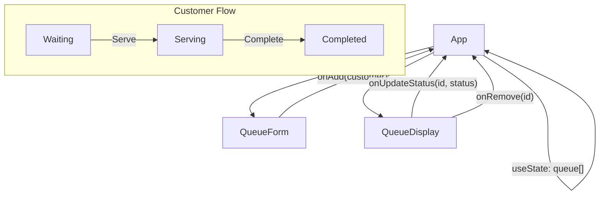

# Queue Management

A simple customer queue management app built with React. You can add customers, track their status, and manage the flow.

## Features

- Add customers with name and service type.
- Track status: **Waiting** → **Serving** → **Completed**.
- Remove customers from the queue.
- Color-coded status indicators.
- Responsive design.

## Tech Stack

- React 19
- Vite
- react-icons

## Architecture



## Project Structure

```
src/
├── App.jsx              # Main app with state management
├── App.improved.css     # Styles
├── main.jsx             # Entry point
└── components/
    ├── QueueForm.jsx    # Add customer form
    └── QueueDisplay.jsx # Queue list with actions
```

## Getting Started

```bash
# Install dependencies
npm install

# Run dev server
npm run dev

# Build for production
npm run build
```
